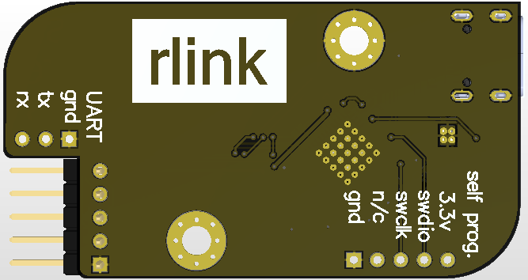
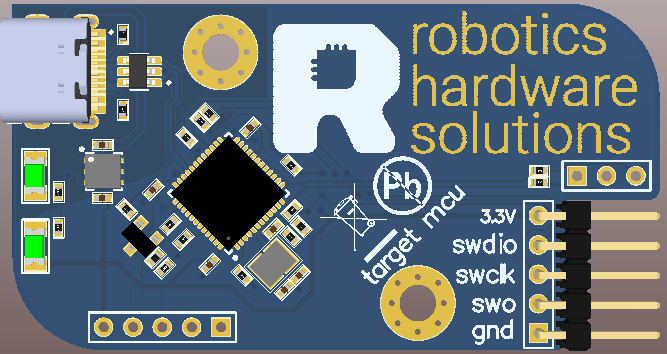

# rlink

mcu programmer (st-link v2.1 or jlink)

[firmware.bin](firmware/firmware.bin) - the firmware for creating the st-link programmer. You can flash it to link using
STLinkReflash.

[jlink_stlink_firmware.bin](firmware/jlink_stlink_firmware.bin) - the firmware for creating the jlink-stlink. You must
change the serial number in the firmware to 0x0000F800. The value must be 0x2EXXXXXX.

