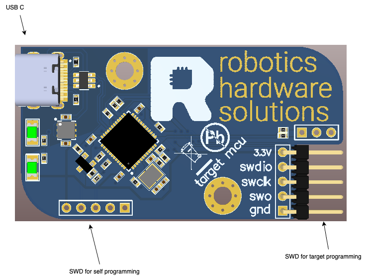

# rlink

mcu programmer (st-link v2.1 or jlink)

[firmware.bin](firmware/firmware.bin) - the firmware for creating the st-link programmer. You can flash it to link using
STLinkReflash.

[jlink_stlink_firmware.bin](firmware/jlink_stlink_firmware.bin) - the firmware for creating the jlink-stlink. You must
change the serial number in the firmware to 0x0000F800. The value must be 0x2EXXXXXX.

## Documentation:
[all documentation files](doc/pcb/) 
[schematic](<doc/pcb/Schematic Prints.PDF>) 
[assembly drawings](<doc/pcb/Assembly Drawings.PDF>) 
[board options](doc/pcb/board_options.txt)

## Pinout and pcb image
   
  
  
